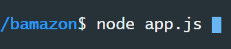

# Bamazon CLI Shopping

Run the app by typing 'node app.js':

It returns a list of available stock:

Enter the ID number of the item you wish to purchase, 

and it asks for a number of items, and asks returns the name of the item to confirm selection before returning how many items are left in stock:

After a purchase is made, the quantity is updated in MySQL, so the next time the program is run the quantity is updated:

